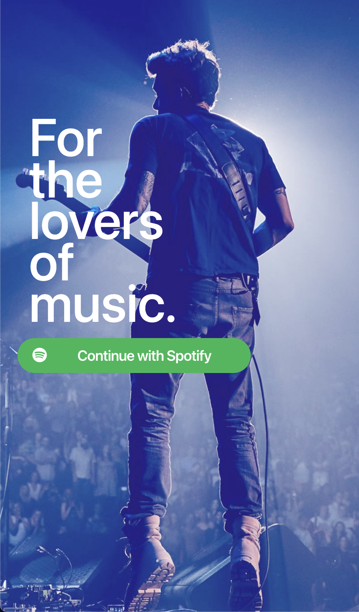
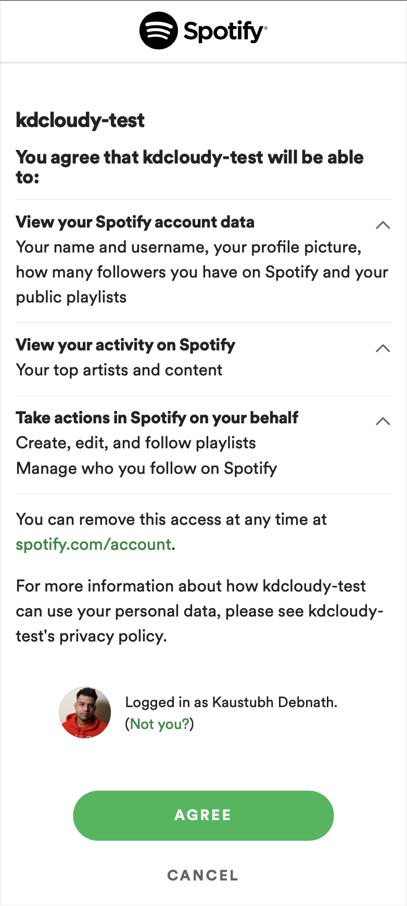
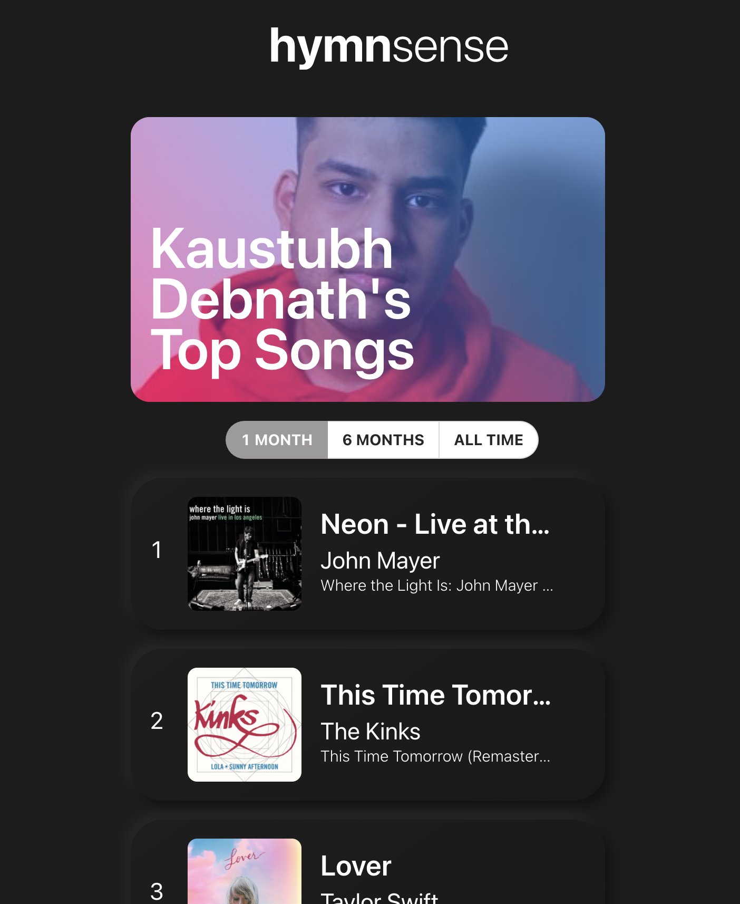

# hymnsense

Uses Spotify API to get user's top listened to tracks

# Setup Guide

1. Register your application with Spotify's API dashboard and add `CLIENT_ID` and `ClIENT_SECRET` to your environment variables.
2. Compiling and running:

```
$ npm install
$ npm run client-install
$ npm run dev
```

Server and client runs on http://localhost:8888 and client on http://localhost:3000 respectively

Screenshots:
<br>



